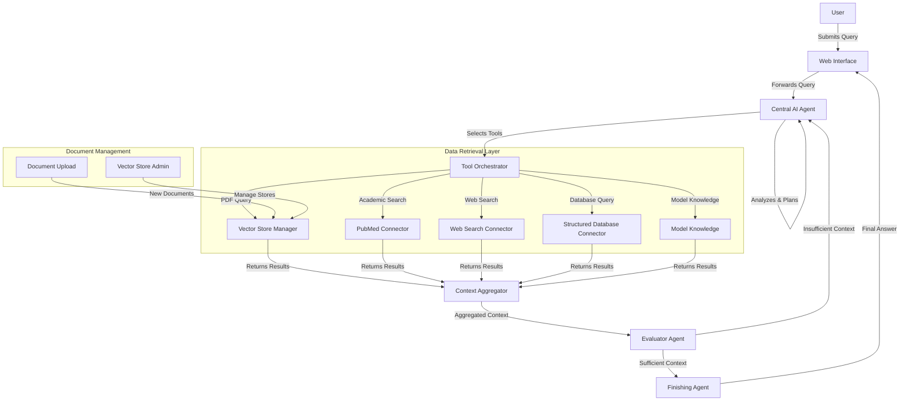
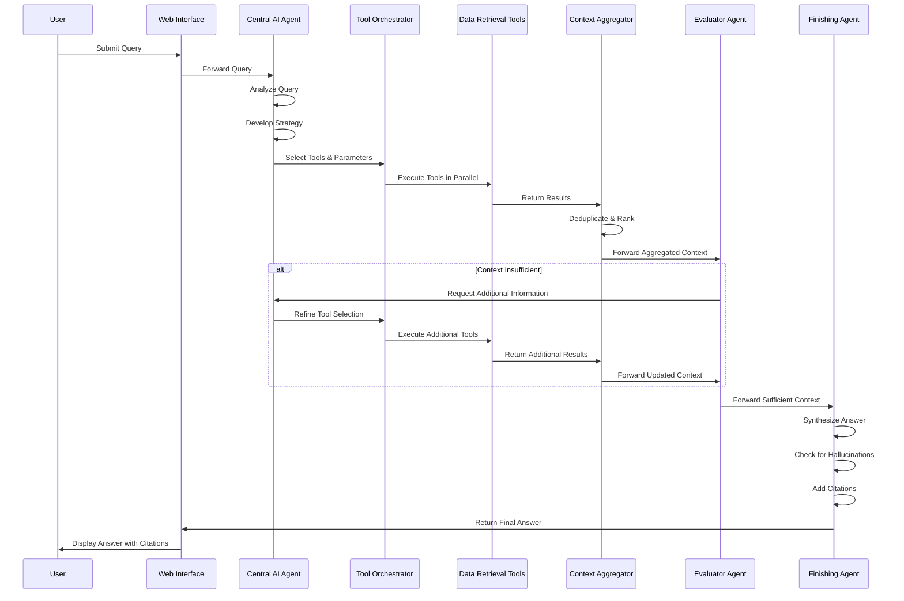
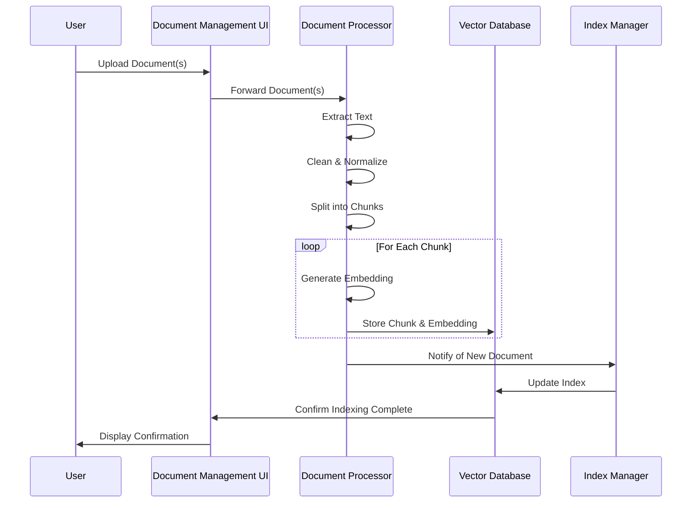
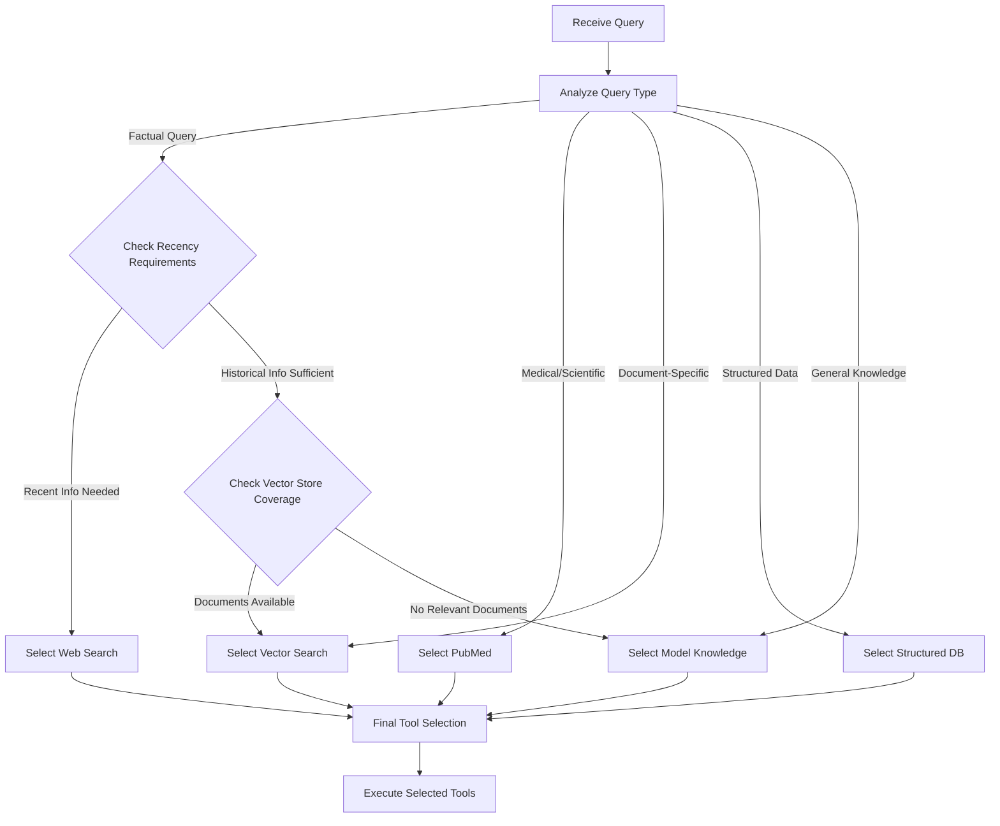
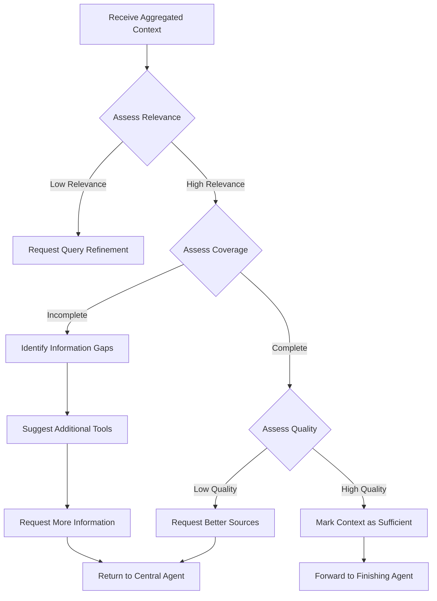

# Agentic RAG Chatbot System Architecture

## 1. System Overview

The architecture follows the workflow outlined, with enhancements based on our discussion:



## 2. Component Details

### 2.1 User Interface Layer

#### Web Interface
- **Functionality**: Clean, intuitive interface for user interactions
- **Features**:
  - Conversation history with persistent storage
  - Detailed citation display for all sources
  - Tool usage transparency (showing which tools were used)
  - Document upload interface for adding to vector stores
  - Vector store selection for topic-specific queries
  - Authentication and user management

#### Document Management Interface
- **Functionality**: Interface for managing document collections
- **Features**:
  - Document upload from local file systems
  - Vector store creation and management
  - Document metadata management
  - Indexing status monitoring

### 2.2 Core Agent Layer

#### Central AI Agent
- **Functionality**: Orchestrates the entire query processing workflow
- **Components**:
  - Query Analyzer: Understands user intent and query requirements
  - Strategy Planner: Determines optimal approach for answering
  - Tool Selector: Chooses appropriate tools based on query analysis
  - Memory Manager: Maintains conversation context
- **Technology**: Commercial LLM APIs (OpenAI, Anthropic, Google) with provider selection capability

#### Evaluator Agent
- **Functionality**: Assesses context sufficiency and quality
- **Components**:
  - Context Quality Checker: Evaluates relevance and reliability
  - Coverage Analyzer: Identifies information gaps
  - Refinement Suggester: Proposes additional queries if needed
- **Technology**: Commercial LLM APIs with configurable provider

#### Finishing Agent
- **Functionality**: Synthesizes final response with citations
- **Components**:
  - Answer Synthesizer: Creates coherent response from context
  - Hallucination Detector: Verifies factual accuracy
  - Citation Generator: Adds proper citations to sources
  - Response Formatter: Structures the final output
- **Technology**: Commercial LLM APIs with configurable provider

### 2.3 Tool Orchestration Layer

#### Tool Orchestrator
- **Functionality**: Manages execution of selected tools
- **Components**:
  - Tool Registry: Maintains available tools and capabilities
  - Execution Engine: Runs tools in parallel or sequence
  - Result Collector: Gathers outputs from all tools
- **Technology**: Custom orchestration service with async capabilities

### 2.4 Data Retrieval Layer

#### Vector Store Manager
- **Functionality**: Manages multiple vector stores for different document collections
- **Components**:
  - Store Registry: Tracks available vector stores
  - Query Processor: Translates natural language to vector queries
  - Result Ranker: Ranks retrieved documents by relevance
- **Technology**: Chroma or Qdrant with multi-tenant support

#### PubMed Connector
- **Functionality**: Searches academic medical literature
- **Components**:
  - Query Formatter: Converts natural language to PubMed syntax
  - Result Parser: Extracts relevant information from results
- **Technology**: PubMed API client with caching

#### Web Search Connector
- **Functionality**: Retrieves information from the internet
- **Components**:
  - Search Engine Adapter: Interfaces with search APIs
  - Content Extractor: Pulls relevant content from web pages
- **Technology**: Search engine APIs (Google, Bing) with content extraction

#### Structured Database Connector
- **Functionality**: Queries structured data sources
- **Components**:
  - Query Translator: Converts natural language to database queries
  - Schema Manager: Maintains database schema information
- **Technology**: Database-specific connectors with query generation

#### Model Knowledge
- **Functionality**: Leverages LLM's built-in knowledge
- **Components**:
  - Knowledge Extractor: Prompts LLM for relevant information
  - Confidence Estimator: Assesses reliability of model knowledge
- **Technology**: Commercial LLM APIs

### 2.5 Context Processing Layer

#### Context Aggregator
- **Functionality**: Combines and processes results from all tools
- **Components**:
  - Deduplication Engine: Removes redundant information
  - Relevance Ranker: Prioritizes most relevant content
  - Context Formatter: Structures context for agent consumption
- **Technology**: Custom aggregation service with NLP capabilities

### 2.6 Document Management Layer

#### Document Processor
- **Functionality**: Processes documents for vector storage
- **Components**:
  - Text Extractor: Extracts text from various file formats
  - Chunker: Splits documents into appropriate segments
  - Embedder: Generates vector embeddings
- **Technology**: Document processing pipeline with embedding service

#### Vector Store Administrator
- **Functionality**: Manages vector store collections
- **Components**:
  - Store Creator: Creates new topic-specific stores
  - Index Manager: Updates and maintains indices
  - Metadata Manager: Manages document metadata
- **Technology**: Admin interface for vector database management

## 3. Detailed Data Flow

### 3.1 Query Processing Flow



### 3.2 Document Processing Flow



### 3.3 Tool Selection Decision Flow



### 3.4 Context Evaluation Flow



## 4. Detailed API Specifications

### 4.1 Internal APIs

#### Central Agent API

**Endpoint**: `/api/agent/central`

**Method**: POST

**Request Body**:
```json
{
  "query": "User query text",
  "conversation_id": "unique_conversation_id",
  "user_id": "user_identifier",
  "preferences": {
    "model_provider": "openai|anthropic|google",
    "model_name": "gpt-4|claude-3|gemini-pro",
    "vector_stores": ["store_id_1", "store_id_2"],
    "citation_format": "apa|mla|chicago",
    "response_length": "concise|detailed",
    "include_tool_details": true
  },
  "context": {
    "previous_messages": [
      {
        "role": "user|assistant",
        "content": "Message content",
        "timestamp": "2023-04-03T21:30:00Z"
      }
    ],
    "user_profile": {
      "expertise_level": "beginner|intermediate|expert",
      "preferred_topics": ["topic1", "topic2"]
    }
  }
}
```

**Response Body**:
```json
{
  "query_id": "unique_query_id",
  "status": "processing|completed|failed",
  "plan": {
    "strategy": "Description of approach",
    "reasoning": "Explanation of strategy selection",
    "selected_tools": [
      {
        "tool_id": "vector_search",
        "reason": "Explanation for selecting this tool",
        "parameters": {
          "query": "Transformed query for vector search",
          "store_ids": ["store_id_1"]
        }
      },
      {
        "tool_id": "pubmed",
        "reason": "Explanation for selecting this tool",
        "parameters": {
          "query": "Transformed query for PubMed"
        }
      }
    ]
  },
  "estimated_completion_time": "2023-04-03T21:45:00Z"
}
```

**Error Responses**:
- 400 Bad Request: Invalid query or missing required parameters
- 401 Unauthorized: Authentication failure
- 500 Internal Server Error: Processing error

#### Tool Orchestrator API

**Endpoint**: `/api/tools/execute`

**Method**: POST

**Request Body**:
```json
{
  "query_id": "unique_query_id",
  "execution_strategy": "parallel|sequential|hybrid",
  "timeout": 30,
  "tools": [
    {
      "tool_id": "vector_search",
      "priority": 1,
      "parameters": {
        "query": "Transformed query for vector search",
        "store_ids": ["store_id_1", "store_id_2"],
        "limit": 10,
        "similarity_threshold": 0.75,
        "include_metadata": true
      }
    },
    {
      "tool_id": "pubmed",
      "priority": 2,
      "parameters": {
        "query": "Transformed query for PubMed",
        "max_results": 5,
        "date_range": {
          "start": "2020-01-01",
          "end": "2023-04-03"
        },
        "article_types": ["clinical_trial", "review"]
      }
    },
    {
      "tool_id": "web_search",
      "priority": 3,
      "parameters": {
        "query": "Transformed query for web search",
        "max_results": 5,
        "recency": "past_year",
        "site_restrictions": ["example.com", "example.org"]
      }
    }
  ]
}
```

**Response Body**:
```json
{
  "query_id": "unique_query_id",
  "status": "completed|partial|failed",
  "execution_time": 2.45,
  "results": {
    "vector_search": {
      "status": "completed",
      "execution_time": 0.85,
      "results": [
        {
          "document_id": "doc123",
          "chunk_id": "chunk456",
          "content": "Relevant text from document",
          "similarity_score": 0.92,
          "metadata": {
            "title": "Document Title",
            "author": "Author Name",
            "date": "2022-05-15",
            "source": "Internal Document",
            "file_name": "document.pdf",
            "page_number": 42
          }
        }
      ],
      "total_results_found": 25,
      "results_returned": 10
    },
    "pubmed": {
      "status": "completed",
      "execution_time": 1.2,
      "results": [
        {
          "pmid": "12345678",
          "title": "Article Title",
          "abstract": "Article abstract text",
          "authors": ["Author 1", "Author 2"],
          "journal": "Journal Name",
          "publication_date": "2022-03-10",
          "doi": "10.1234/example.12345",
          "url": "https://pubmed.ncbi.nlm.nih.gov/12345678/"
        }
      ],
      "total_results_found": 42,
      "results_returned": 5
    },
    "web_search": {
      "status": "completed",
      "execution_time": 1.8,
      "results": [
        {
          "title": "Web Page Title",
          "url": "https://example.com/page",
          "snippet": "Relevant snippet from the web page",
          "published_date": "2023-01-15",
          "extracted_content": "Full extracted content from the page"
        }
      ],
      "total_results_found": 1250,
      "results_returned": 5
    }
  },
  "failed_tools": [],
  "warnings": []
}
```

**Error Responses**:
- 400 Bad Request: Invalid tool configuration
- 404 Not Found: Query ID not found
- 408 Request Timeout: Tool execution exceeded timeout
- 500 Internal Server Error: Execution error

#### Context Aggregator API

**Endpoint**: `/api/context/aggregate`

**Method**: POST

**Request Body**:
```json
{
  "query_id": "unique_query_id",
  "original_query": "User query text",
  "tool_results": {
    "tool_id_1": { ... tool specific results ... },
    "tool_id_2": { ... tool specific results ... }
  },
  "aggregation_strategy": {
    "deduplication": true,
    "relevance_threshold": 0.6,
    "max_context_items": 20,
    "prioritize_recent": true
  }
}
```

**Response Body**:
```json
{
  "query_id": "unique_query_id",
  "aggregated_context": [
    {
      "content": "Context item text",
      "source": {
        "tool_id": "vector_search",
        "document_id": "doc123",
        "chunk_id": "chunk456",
        "metadata": { ... source metadata ... }
      },
      "relevance_score": 0.92,
      "citation_id": "citation_1"
    }
  ],
  "context_stats": {
    "total_items_before_filtering": 45,
    "items_after_deduplication": 32,
    "items_after_relevance_filtering": 20,
    "sources_distribution": {
      "vector_search": 12,
      "pubmed": 5,
      "web_search": 3
    }
  },
  "suggested_follow_up_queries": [
    "Suggested follow-up query 1",
    "Suggested follow-up query 2"
  ]
}
```

**Error Responses**:
- 400 Bad Request: Invalid aggregation parameters
- 404 Not Found: Query ID not found
- 500 Internal Server Error: Aggregation error

#### Evaluator Agent API

**Endpoint**: `/api/agent/evaluator`

**Method**: POST

**Request Body**:
```json
{
  "query_id": "unique_query_id",
  "original_query": "User query text",
  "aggregated_context": [
    {
      "content": "Context item text",
      "source": { ... source information ... },
      "relevance_score": 0.92,
      "citation_id": "citation_1"
    }
  ],
  "preferences": {
    "model_provider": "openai|anthropic|google",
    "model_name": "gpt-4|claude-3|gemini-pro",
    "evaluation_strictness": "lenient|standard|strict"
  }
}
```

**Response Body**:
```json
{
  "query_id": "unique_query_id",
  "is_sufficient": true|false,
  "confidence_score": 0.85,
  "evaluation_details": {
    "relevance_assessment": {
      "score": 0.9,
      "explanation": "The context contains highly relevant information about..."
    },
    "completeness_assessment": {
      "score": 0.8,
      "explanation": "The context covers most aspects of the query, but lacks..."
    },
    "reliability_assessment": {
      "score": 0.85,
      "explanation": "The sources are generally reliable, with information from..."
    }
  },
  "missing_information": [
    {
      "description": "Information about specific treatment outcomes",
      "importance": "high|medium|low"
    }
  ],
  "suggested_tools": [
    {
      "tool_id": "pubmed",
      "parameters": {
        "query": "Refined query for PubMed",
        "filters": { ... suggested filters ... }
      },
      "reason": "To find specific treatment outcome studies"
    }
  ],
  "suggested_query_reformulations": [
    "Suggested query reformulation 1",
    "Suggested query reformulation 2"
  ]
}
```

**Error Responses**:
- 400 Bad Request: Invalid evaluation parameters
- 404 Not Found: Query ID not found
- 500 Internal Server Error: Evaluation error

#### Finishing Agent API

**Endpoint**: `/api/agent/finisher`

**Method**: POST

**Request Body**:
```json
{
  "query_id": "unique_query_id",
  "original_query": "User query text",
  "aggregated_context": [
    {
      "content": "Context item text",
      "source": { ... source information ... },
      "relevance_score": 0.92,
      "citation_id": "citation_1"
    }
  ],
  "preferences": {
    "model_provider": "openai|anthropic|google",
    "model_name": "gpt-4|claude-3|gemini-pro",
    "citation_format": "apa|mla|chicago",
    "response_length": "concise|detailed",
    "include_uncertainty": true,
    "language_style": "formal|conversational"
  }
}
```

**Response Body**:
```json
{
  "query_id": "unique_query_id",
  "answer": {
    "text": "Formatted answer text with inline citation markers[1][2]",
    "sections": [
      {
        "type": "introduction",
        "content": "Introduction text"
      },
      {
        "type": "main_content",
        "content": "Main content with citations[1]"
      },
      {
        "type": "conclusion",
        "content": "Conclusion text"
      }
    ]
  },
  "citations": [
    {
      "id": "1",
      "text": "Formatted citation for source 1",
      "source": {
        "tool_id": "vector_search",
        "document_id": "doc123",
        "metadata": { ... source metadata ... }
      },
      "url": "Optional URL"
    },
    {
      "id": "2",
      "text": "Formatted citation for source 2",
      "source": {
        "tool_id": "pubmed",
        "pmid": "12345678",
        "metadata": { ... source metadata ... }
      },
      "url": "https://pubmed.ncbi.nlm.nih.gov/12345678/"
    }
  ],
  "tools_used": [
    {
      "tool_id": "vector_search",
      "store_ids": ["store_id_1"],
      "result_count": 5,
      "contribution_score": 0.7
    },
    {
      "tool_id": "pubmed",
      "result_count": 3,
      "contribution_score": 0.3
    }
  ],
  "confidence_assessment": {
    "overall_confidence": "high|medium|low",
    "uncertain_aspects": [
      {
        "description": "The exact efficacy rate of the treatment",
        "reason": "Studies show varying results between 65-80%"
      }
    ]
  },
  "follow_up_suggestions": [
    "Suggested follow-up query 1",
    "Suggested follow-up query 2"
  ]
}
```

**Error Responses**:
- 400 Bad Request: Invalid finishing parameters
- 404 Not Found: Query ID not found
- 500 Internal Server Error: Finishing error

### 4.2 External APIs

#### User Query API

**Endpoint**: `/api/query`

**Method**: POST

**Request Body**:
```json
{
  "query": "User query text",
  "conversation_id": "unique_conversation_id",
  "preferences": {
    "model_provider": "openai|anthropic|google",
    "model_name": "gpt-4|claude-3|gemini-pro",
    "vector_stores": ["store_id_1", "store_id_2"],
    "citation_format": "apa|mla|chicago",
    "response_length": "concise|detailed",
    "include_tool_details": true
  }
}
```

**Response Body**:
```json
{
  "query_id": "unique_query_id",
  "status": "processing",
  "estimated_completion_time": "2023-04-03T21:45:00Z"
}
```

**Error Responses**:
- 400 Bad Request: Invalid query
- 401 Unauthorized: Authentication failure
- 500 Internal Server Error: Processing error

#### Query Status API

**Endpoint**: `/api/query/{query_id}/status`

**Method**: GET

**Response Body**:
```json
{
  "query_id": "unique_query_id",
  "status": "processing|completed|failed",
  "progress": 0.75,
  "current_stage": "tool_execution|context_aggregation|evaluation|finishing",
  "estimated_completion_time": "2023-04-03T21:45:00Z",
  "tools_status": [
    {
      "tool_id": "vector_search",
      "status": "completed|processing|pending|failed",
      "progress": 1.0
    },
    {
      "tool_id": "pubmed",
      "status": "processing",
      "progress": 0.5
    }
  ]
}
```

**Error Responses**:
- 404 Not Found: Query ID not found
- 500 Internal Server Error: Status retrieval error

#### Query Result API

**Endpoint**: `/api/query/{query_id}/result`

**Method**: GET

**Response Body**:
```json
{
  "query_id": "unique_query_id",
  "original_query": "User query text",
  "answer": {
    "text": "Formatted answer text with inline citation markers[1][2]",
    "sections": [
      {
        "type": "introduction",
        "content": "Introduction text"
      },
      {
        "type": "main_content",
        "content": "Main content with citations[1]"
      },
      {
        "type": "conclusion",
        "content": "Conclusion text"
      }
    ]
  },
  "citations": [
    {
      "id": "1",
      "text": "Formatted citation for source 1",
      "source": {
        "tool_id": "vector_search",
        "document_id": "doc123",
        "metadata": { ... source metadata ... }
      },
      "url": "Optional URL"
    },
    {
      "id": "2",
      "text": "Formatted citation for source 2",
      "source": {
        "tool_id": "pubmed",
        "pmid": "12345678",
        "metadata": { ... source metadata ... }
      },
      "url": "https://pubmed.ncbi.nlm.nih.gov/12345678/"
    }
  ],
  "tools_used": [
    {
      "tool_id": "vector_search",
      "store_ids": ["store_id_1"],
      "result_count": 5,
      "contribution_score": 0.7
    },
    {
      "tool_id": "pubmed",
      "result_count": 3,
      "contribution_score": 0.3
    }
  ],
  "confidence_assessment": {
    "overall_confidence": "high|medium|low",
    "uncertain_aspects": [
      {
        "description": "The exact efficacy rate of the treatment",
        "reason": "Studies show varying results between 65-80%"
      }
    ]
  },
  "follow_up_suggestions": [
    "Suggested follow-up query 1",
    "Suggested follow-up query 2"
  ],
  "conversation_id": "unique_conversation_id",
  "timestamp": "2023-04-03T21:45:00Z",
  "processing_time": 3.2
}
```

**Error Responses**:
- 404 Not Found: Query ID not found
- 500 Internal Server Error: Result retrieval error

#### Document Upload API

**Endpoint**: `/api/documents/upload`

**Method**: POST

**Request Body**:
```json
{
  "store_id": "store_id_1",
  "documents": [
    {
      "file_name": "document.pdf",
      "file_content": "base64_encoded_content",
      "metadata": {
        "title": "Document Title",
        "author": "Author Name",
        "date": "2023-01-15",
        "tags": ["tag1", "tag2"],
        "description": "Document description",
        "source": "Document source",
        "custom_fields": {
          "field1": "value1",
          "field2": "value2"
        }
      },
      "processing_options": {
        "chunk_size": 1000,
        "chunk_overlap": 200,
        "extract_images": true,
        "ocr_enabled": true,
        "language": "en"
      }
    }
  ],
  "batch_id": "optional_batch_identifier"
}
```

**Response Body**:
```json
{
  "job_id": "unique_job_id",
  "status": "processing",
  "document_count": 1,
  "estimated_completion_time": "2023-04-03T22:00:00Z",
  "documents_status": [
    {
      "file_name": "document.pdf",
      "status": "processing",
      "document_id": "doc123"
    }
  ]
}
```

**Error Responses**:
- 400 Bad Request: Invalid document format
- 401 Unauthorized: Authentication failure
- 413 Payload Too Large: Document size exceeds limit
- 500 Internal Server Error: Processing error

#### Vector Store Management API

**Endpoint**: `/api/vector-stores/create`

**Method**: POST

**Request Body**:
```json
{
  "name": "Medical Literature",
  "description": "Vector store for medical research papers",
  "embedding_model": "openai|sentence-transformers|...",
  "embedding_model_version": "text-embedding-3-large",
  "metadata_schema": {
    "required": ["title", "date"],
    "properties": {
      "title": {"type": "string"},
      "author": {"type": "string"},
      "date": {"type": "string", "format": "date"},
      "tags": {"type": "array", "items": {"type": "string"}},
      "source": {"type": "string"},
      "publication": {"type": "string"},
      "custom_fields": {
        "type": "object",
        "additionalProperties": true
      }
    }
  },
  "access_control": {
    "owner": "user_id",
    "visibility": "private|shared|public",
    "shared_with": ["user_id_1", "user_id_2"]

**Method**: POST

**Request Body**:
```json
{
  "store_id": "store_id_1",
  "documents": [
    {
      "file_name": "document.pdf",
      "file_content": "base64_encoded_content",
      "metadata": {
        "title": "Document Title",
        "author": "Author Name",
        "date": "2023-01-15",
        "tags": ["tag1", "tag2"],
        "description": "Document description",
        "source": "Document source",
        "custom_fields": {
          "field1": "value1",
          "field2": "value2"
        }
      },
      "processing_options": {
        "chunk_size": 1000,
        "chunk_overlap": 200,
        "extract_images": true,
        "ocr_enabled": true,
        "language": "en"
      }
    }
  ],
  "batch_id": "optional_batch_identifier"
}
```

**Response Body**:
```json
{
  "job_id": "unique_job_id",
  "status": "processing",
  "document_count": 1,
  "estimated_completion_time": "2023-04-03T22:00:00Z",
  "documents_status": [
    {
      "file_name": "document.pdf",
      "status": "processing",
      "document_id": "doc123"
    }
  ]
}
```

**Error Responses**:
- 400 Bad Request: Invalid document format
- 401 Unauthorized: Authentication failure
- 413 Payload Too Large: Document size exceeds limit
- 500 Internal Server Error: Processing error

#### Vector Store Management API

**Endpoint**: `/api/vector-stores/create`

**Method**: POST

**Request Body**:
```json
{
  "name": "Medical Literature",
  "description": "Vector store for medical research papers",
  "embedding_model": "openai|sentence-transformers|...",
  "embedding_model_version": "text-embedding-3-large",
  "metadata_schema": {
    "required": ["title", "date"],
    "properties": {
      "title": {"type": "string"},
      "author": {"type": "string"},
      "date": {"type": "string", "format": "date"},
      "tags": {"type": "array", "items": {"type": "string"}},
      "source": {"type": "string"},
      "publication": {"type": "string"},
      "custom_fields": {
        "type": "object",
        "additionalProperties": true
      }
    }
  },
  "access_control": {
    "owner": "user_id",
    "visibility": "private|shared|public",
    "shared_with": ["user_id_1", "user_id_2"]
