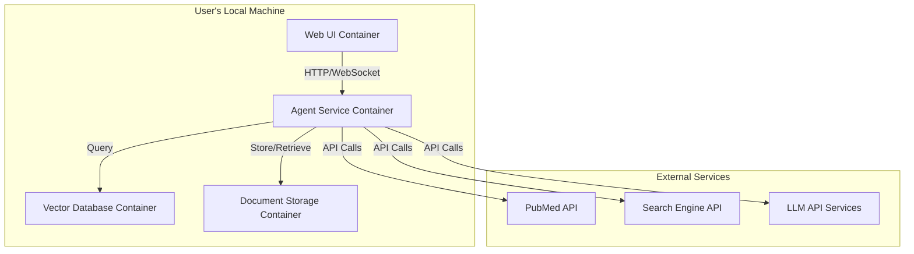

## 5. Storage Requirements

### 5.1 Vector Database
- **Technology**: Chroma or Qdrant
- **Storage Requirements**:
  - Document embeddings: ~1KB per chunk × number of chunks
  - Metadata: ~0.5KB per document
  - Scaling: Linear with document count
- **Performance Requirements**:
  - Query latency: <200ms for typical queries
  - Indexing throughput: Support for batch processing
- **Features**:
  - Multi-tenant support for topic-specific stores
  - Metadata filtering
  - Hybrid search (vector + keyword)

### 5.2 Document Storage
- **Technology**: File system or object storage
- **Storage Requirements**:
  - Original documents: Variable size (typically 100KB-10MB per document)
  - Extracted text: ~20% of original document size
- **Features**:
  - Version control for document updates
  - Access control based on user permissions
  - Backup and recovery mechanisms

### 5.3 Conversation Storage
- **Technology**: Document database (e.g., MongoDB)
- **Storage Requirements**:
  - Conversation history: ~5KB per exchange
  - User preferences: ~1KB per user
- **Features**:
  - Time-based retention policies
  - User-specific history access
  - Search capabilities for past conversations

### 5.4 Cache Storage
- **Technology**: In-memory cache (e.g., Redis)
- **Storage Requirements**:
  - Query results: ~10-50KB per query
  - Tool outputs: ~5-20KB per tool execution
- **Features**:
  - Time-based expiration
  - LRU eviction policies
  - Distributed caching for scalability

## 6. Deployment Architecture

### 6.1 Docker Containers

#### Web UI Container
- **Components**:
  - Web server (Nginx)
  - Frontend application (React/Vue)
  - WebSocket server for real-time updates
- **Resource Requirements**:
  - CPU: 1 core
  - Memory: 1GB
  - Storage: 1GB

#### Agent Service Container
- **Components**:
  - API server (FastAPI/Flask)
  - Agent orchestration service
  - Tool connectors
  - Context processing services
- **Resource Requirements**:
  - CPU: 2-4 cores
  - Memory: 4-8GB
  - Storage: 10GB

#### Vector Database Container
- **Components**:
  - Chroma or Qdrant instance
  - Embedding service
- **Resource Requirements**:
  - CPU: 2-4 cores
  - Memory: 4-16GB (depending on index size)
  - Storage: 50-500GB (depending on document volume)

#### Document Storage Container
- **Components**:
  - Document database
  - File storage service
- **Resource Requirements**:
  - CPU: 1-2 cores
  - Memory: 2-4GB
  - Storage: 100GB-1TB (depending on document volume)

### 6.2 Networking

- **Internal Communication**:
  - Docker network for inter-container communication
  - REST APIs and gRPC for service-to-service communication
  - WebSockets for real-time updates to UI

- **External Communication**:
  - HTTPS for all external API calls
  - API key authentication for external services
  - Rate limiting for external API usage

### 6.3 Scalability Considerations

- **Horizontal Scaling**:
  - Stateless components (Agent Service) can be replicated
  - Load balancing for distributed deployments

- **Vertical Scaling**:
  - Vector database can be scaled with more memory/CPU
  - Document storage can be expanded with additional disk space

- **Resource Optimization**:
  - Caching frequently used embeddings and query results
  - Batch processing for document indexing
  - Asynchronous processing for non-blocking operations

## 7. Security Considerations

### 7.1 Authentication and Authorization
- User authentication via standard protocols (OAuth, JWT)
- Role-based access control for document management
- API key management for external service access

### 7.2 Data Protection
- Encryption of sensitive data at rest
- Secure communication channels (TLS/SSL)
- Data minimization in LLM prompts

### 7.3 Privacy Considerations
- User consent for data processing
- Audit logging of all system actions
- Ability to delete user data and conversation history

### 7.4 LLM Security
- Prompt injection prevention
- Output filtering for sensitive information
- Regular security audits of model behavior

### 7.5 Container Security
- Regular security updates for container images
- Principle of least privilege for container permissions
- Network policy enforcement between containers

## 8. Implementation Roadmap

### Phase 1: Core Infrastructure (Weeks 1-3)
- Set up Docker environment
- Implement basic web UI
- Deploy vector database
- Create document storage system
- Implement authentication system

### Phase 2: Agent Framework (Weeks 4-6)
- Implement Central AI Agent
- Develop Tool Orchestrator
- Create basic tool connectors (vector search, web search)
- Build Context Aggregator
- Implement API server

### Phase 3: Advanced Features (Weeks 7-9)
- Implement Evaluator and Finishing Agents
- Add PubMed and structured database connectors
- Develop citation and source tracking
- Create document upload and management interface
- Implement conversation history

### Phase 4: Refinement and Optimization (Weeks 10-12)
- Optimize query performance
- Enhance user interface
- Implement advanced caching
- Add monitoring and analytics
- Conduct security audit

## 9. Monitoring and Maintenance

### 9.1 System Monitoring
- Container health and resource usage
- API performance metrics
- Error rate tracking
- Query latency monitoring

### 9.2 LLM Performance Monitoring
- Response quality assessment
- Hallucination detection rates
- Citation accuracy tracking
- User feedback collection

### 9.3 Maintenance Procedures
- Regular vector database reindexing
- LLM prompt optimization
- External API integration updates
- Security patches and updates

### 9.4 Analytics and Reporting
- Usage statistics dashboard
- Query pattern analysis
- Document utilization metrics
- Performance trend reporting